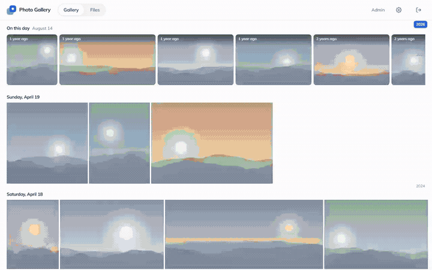
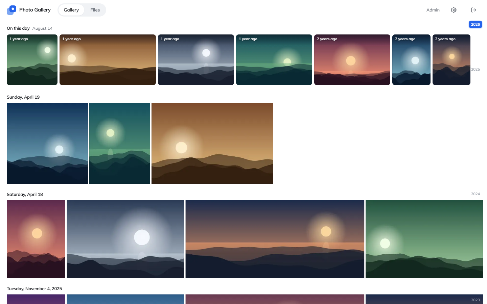
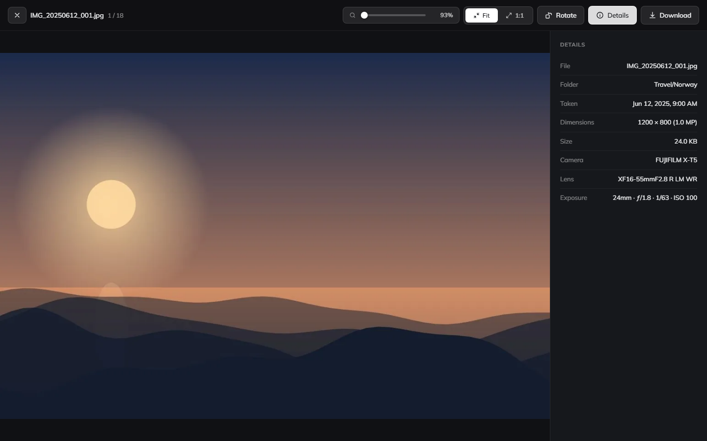
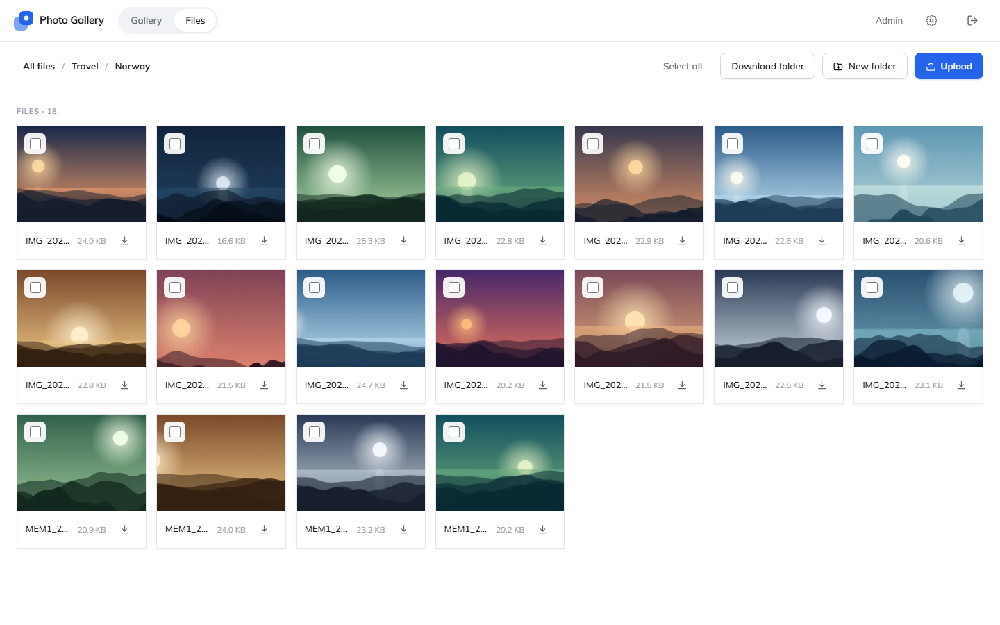
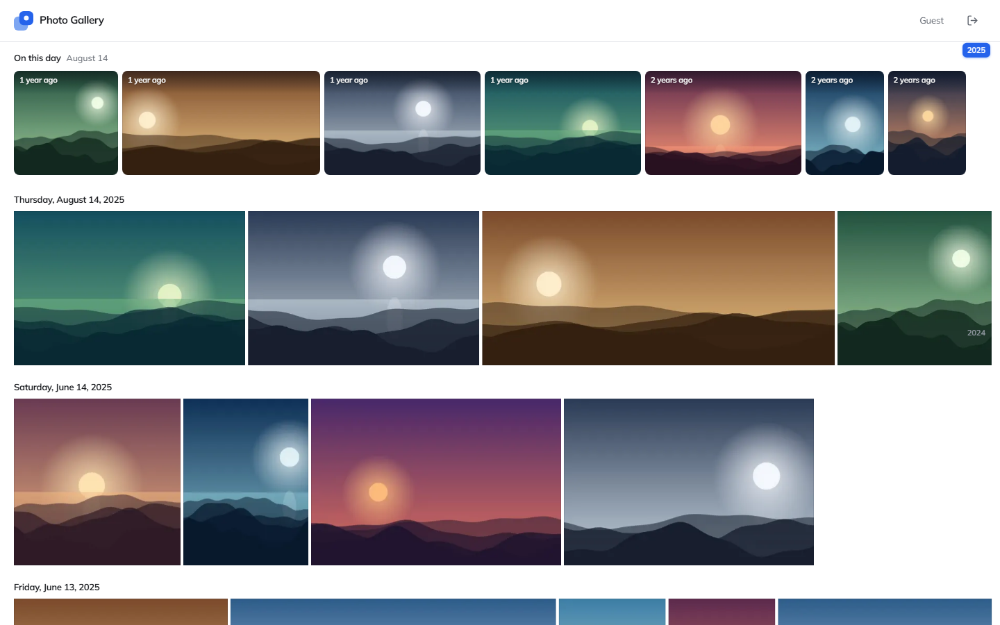
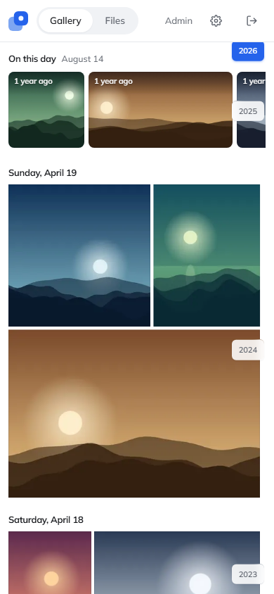
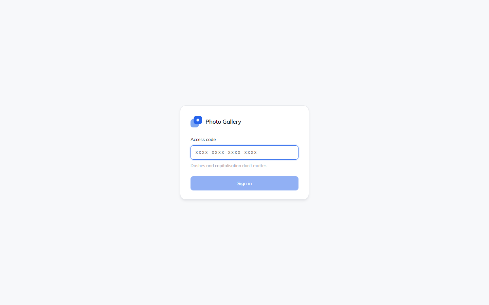
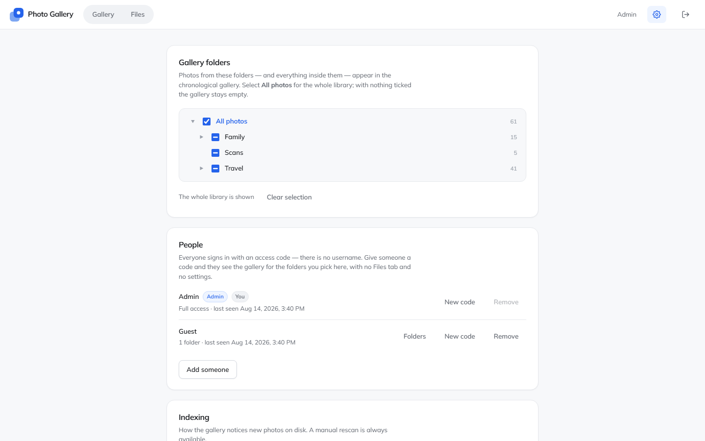

# Photo Gallery

A self-hosted photo gallery for a folder of pictures on your own machine. No cloud, no external
services, no database server — just Node, SQLite and a folder of photos.

[](https://github.com/martinchrzan/Gallery/actions/workflows/ci.yml)
[](LICENSE)
[](https://nodejs.org)



Built to stay fluid at tens of thousands of photos: the feed arrives as a packed binary manifest,
the layout is recomputed in a few milliseconds, and only the rows near the viewport are ever
mounted.

> The photos in every screenshot here are generated by
> [`tools/fixture-library.mjs`](tools/fixture-library.mjs) — the same library the tests run against.

---

## Features

### One chronological feed

Every photo and video from the folders you choose, sorted by the date it was taken, with day
separators and a year scrubber down the side. Jumping to 2014 is instant, because the client knows
the exact height of the whole feed before it draws anything.



### A full-screen viewer

Zoom, pan, rotate, and a details panel with the camera, lens and exposure read out of the file's
EXIF. Videos sit in the same feed and play in the same viewer.



### On this day

The handful of photos taken on today's date in earlier years, picked fresh each morning and stable
for the rest of the day. Computed entirely on the client — no extra request, no server work.

### Files

The raw folder tree, browsable to any depth, with single-file and ZIP downloads. New folders, and
uploads into any of them — including from a phone, over a tunnel that caps request bodies.



### Sharing, without handing over the library

Hand someone an access code and they get the gallery for the folders you picked, and nothing else.
No Files tab, no settings, and no way to address a photo outside those folders — not even by
guessing its id.

<table>
<tr>
<td width="50%"></td>
<td width="50%"></td>
</tr>
<tr>
<td><em><strong>Admin</strong> — Gallery and Files tabs, a settings button, the whole library.</em></td>
<td><em><strong>Viewer</strong> — no tabs, no settings, and only the folders they were given. The routes behind those tabs refuse them too, not just the buttons.</em></td>
</tr>
</table>

### On a phone

The same gallery, laid out for a narrow screen, with swipe navigation in the viewer and uploads that
survive a flaky connection.



### And the rest

- **Videos** in the same chronological feed as the photos, with a poster frame, a play badge and
  their runtime on the tile.
- **Thumbnails** generated with libvips, cached on disk as WebP in three sizes, keyed by file
  contents so an edited photo automatically gets a fresh URL.
- **Stays in sync** — watch the folder live, re-scan on a timer, or scan on demand.
- **Capture dates** from EXIF, falling back to the filename (`IMG_20190704_…`) and then the file's
  own date.
- **Resumable uploads**, chunked so no single request is large, with the chunk size following the
  connection.
- **Settings stored server-side**, so they follow you between browsers.
- **Light and dark themes**, following the device by default, with a toggle in the top bar
  that each browser remembers — viewers included.
- **Installable** — "Add to Home Screen" on a phone opens the gallery full-screen, with its own
  icon, rather than as a browser tab.
- **Dates in your own locale**, with no translation files involved.

---

## Getting started

You need [Node 22 or newer](https://nodejs.org) — `better-sqlite3` requires it.

```bash
git clone https://github.com/martinchrzan/Gallery.git
cd Gallery
npm install
cp config.example.json config.json   # then set "photosRoot"
npm run build
npm start
```

On the first run the server prints an admin access code to the console. Open
<http://localhost:4000>, sign in with it, and the first scan starts automatically — photos appear as
they are indexed, so there is nothing to wait for.



The code is stored only as a hash and cannot be shown again. If you lose it, restart once with
`GALLERY_ADMIN_CODE` set to whatever you want it to be:

```bash
GALLERY_ADMIN_CODE=my-new-code npm start
```

### Configuration

`config.json` at the repo root. Only `photosRoot` is required.

| Key | Meaning | Default |
| --- | --- | --- |
| `photosRoot` | Folder to serve. Written to only by an admin's upload; nothing else here modifies it. | *required* |
| `port` | HTTP port. | `4000` |
| `host` | Bind address. `0.0.0.0` exposes it to your LAN. | `0.0.0.0` |
| `dataDir` | Where the index and thumbnail cache live. | `./data` |
| `trustProxy` | Honour `X-Forwarded-*`. Turn this on behind a tunnel or reverse proxy. | `false` |
| `logToFile` | Write `<dataDir>/logs/gallery-<date>.log`, one file per day. | `true` |
| `logConsole` | Also write to stdout. | `true` |
| `logCleanup` | Delete dated log files once they age out. | `true` |
| `logRetentionDays` | How many days of them to keep. | `30` |
| `ffmpegPath` | Explicit ffmpeg binary, for video thumbnails. | bundled, else `PATH` |
| `ffprobePath` | Explicit ffprobe binary, for video metadata. | bundled, else `PATH` |

Any of these can be overridden by the `PHOTOS_ROOT`, `PORT`, `HOST`, `DATA_DIR`, `TRUST_PROXY`,
`LOG_TO_FILE`, `LOG_CONSOLE`, `LOG_CLEANUP`, `LOG_RETENTION_DAYS`, `FFMPEG_PATH` and `FFPROBE_PATH`
environment variables, which is what the service installers use.

Everything else — which folders feed the gallery, who can see them, how often it re-indexes, row
height — is configured in the app's Settings page and stored server-side.



### Sharing it with someone

Add people under **Settings → People**: pick their folders, and you get a code to send them. There
is no username — the access code is the identity as well as the proof of it, so sharing the gallery
means sending one string. Codes are *generated*, never chosen: 16 characters from a 30-symbol
alphabet, about 78 bits.

Issuing a new code for someone signs them out everywhere immediately, so a leaked code is a one-click
fix.

Settings also shows who has actually been using it: a day-by-day heatmap per person, and every
device that has signed in — its browser, its address and when it was last active. The last 90 days
are kept.

### Exposing it to the internet

**Use HTTPS.** Everything above assumes the code is not readable in transit; over plain HTTP it is
sent in the clear on every sign-in. A tunnel — Cloudflare Tunnel, Tailscale — gets you TLS without
opening a port on your router. Set `trustProxy` to `true` when you do, so the rate limiter and the
activity record see real client addresses and session cookies get marked `Secure`.

There is more on how access control actually works — and why it answers `404` rather than `403` — in
[the architecture notes](docs/architecture.md#access-control).

---

## Supported formats

**Photos.** JPEG, PNG, WebP, AVIF, GIF and TIFF appear in the gallery. HEIC/HEIF and camera RAW
(`.cr2`, `.cr3`, `.nef`, `.arw`, `.dng`, `.orf`, `.rw2`, `.raf`, `.pef`, `.srw`) are listed in
**Files** and can be downloaded, but are not thumbnailed or shown in the feed — the stock libvips
build cannot decode them.

**Videos.** MP4, M4V, MOV, WebM, MKV, AVI, 3GP, MPEG, MTS/M2TS, WMV, FLV and OGV are indexed,
thumbnailed and ordered by their container's capture date. Whether one *plays* is your browser's
decision, not the gallery's — MP4/H.264 plays everywhere; an AVI gets a proper tile and then a
download button.

Video thumbnails need ffmpeg. `npm install` fetches a prebuilt ffmpeg and ffprobe as *optional*
dependencies, so normally there is nothing to do; without them videos still appear, still sort and
still play, but lose their poster tiles, dimensions, durations and container dates. Install ffmpeg
later and the next scan fills all of that in.

## Keyboard shortcuts

In the full-screen viewer. Everything below `I` acts on a still image, so a video ignores them and
keeps the keys for its own player instead:

| Key | Action |
| --- | --- |
| `←` `→` | Previous / next photo |
| `Esc` | Close |
| `I` | Toggle the details panel |
| `D` | Download the original |
| `F` / `Enter` | Toggle between fit and zoomed |
| `+` `−` | Zoom in / out |
| `0` | Reset to fit |
| `R` / `Shift`+`R` | Rotate a quarter turn clockwise / anticlockwise |

Rotate turns the photo on screen only — nothing is written to your photos folder or to the index.
Double-click or pinch to zoom, drag to pan, and click anywhere outside the photo to close it.

---

## Running it as a service

Scripts in [`deploy/windows`](deploy/windows) register the gallery to start at boot and restart if it
exits, either through [NSSM](https://nssm.cc/download) or a Scheduled Task:

```powershell
.\deploy\windows\install-service.ps1 -PhotosRoot 'D:\Photos' -DataDir 'C:\GalleryData'
```

See [`deploy/windows/README.md`](deploy/windows/README.md) for the options, the two things worth
getting right about `DataDir` and UNC paths, and what to do when a service refuses to start.

## Development

```bash
npm run dev          # API on :4000, Vite dev server on :5173 with hot reload
npm run typecheck
npm test             # unit and integration tests
npm run test:e2e     # end-to-end tests against a real server
```

`npm test` runs 210 unit and integration tests across both workspaces in a few seconds; nothing needs
to be running first. `npm run test:e2e` builds nothing itself — run `npm run build` first — then
generates a photo library, starts the real server against it and drives a browser through the whole
app.

Regenerate the images in this README with `npm run screenshots`, and the GIF with `npm run demo`.

More on how the pieces fit together — the index, the binary manifest, the thumbnail cache, the upload
protocol, and the reasoning behind each — is in [`docs/architecture.md`](docs/architecture.md).
[`docs/testing.md`](docs/testing.md) covers the test layout.

## Layout

```
server/   Fastify API, SQLite index, scanner, thumbnailer
web/      React + Vite front end
e2e/      Playwright tests, and the server launcher they run against
tools/    Photo-library generator, demo GIF recorder
docs/     Architecture and testing notes, README images
deploy/   Windows service and scheduled-task installers
data/     Generated: the SQLite index, sessions and the thumbnail cache
```

In production the server also serves the built front end, so the whole thing is one process.

## License

[MIT](LICENSE).
